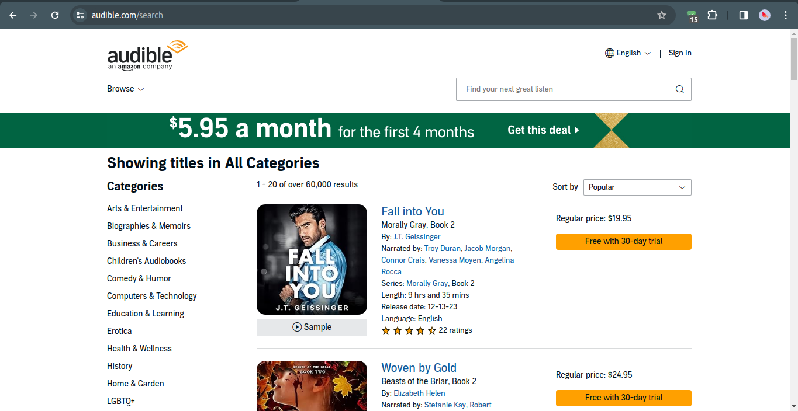

# Audible Bestsellers Scraper




This Python script is designed to scrape Audible bestseller information using Selenium and Chrome WebDriver. It extracts book titles, authors, and lengths and saves the data to a CSV file.

## Table of Contents

- [Audible Bestsellers Scraper](#audible-bestsellers-scraper)
  - [Table of Contents](#table-of-contents)
  - [Prerequisites](#prerequisites)
  - [Installation](#installation)
  - [Usage](#usage)
  - [Contributing](#contributing)
  - [License](#license)

## Prerequisites

- [Python](https://www.python.org/downloads/) installed
- [ChromeDriver](https://sites.google.com/chromium.org/driver/) installed and added to your system's PATH
- Required Python packages installed: `click`, `matplotlib`, `selenium`, `pandas`

```bash
pip install click matplotlib selenium pandas
```

## Installation

1. Clone the repository:

```bash
git clone https://github.com/kirubel-web/audible-scraper.git
cd audible-scraper
```

2. Set up a virtual environment (optional but recommended):

```bash
python -m venv venv
source venv/bin/activate  # On Windows, use `venv\Scripts\activate`
```

3. Install dependencies:

```bash
pip install -r requirements.txt
```

4. Download ChromeDriver and update `chrome_driver_path` variable in the script with the correct path.

## Usage

1. Run the script:

```bash
python audible.py
```

2. The script will open a Chrome window, navigate to the Audible bestsellers page, and scrape the data.

3. Once the process is complete, a CSV file named `Audible.csv` will be generated with the extracted information.

## Contributing

Contributions are welcome! If you find a bug or have an enhancement in mind, please open an issue or create a pull request.

## License

This project is licensed under the MIT License - see the [LICENSE](LICENSE) file for details.
